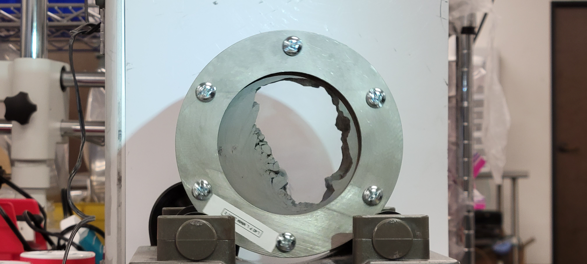

# Metal Powder Flow Measurement Device

> *Scientific measurement instrument for characterizing the flow behavior of powdered metal feedstock used in additive manufacturing — designed, additively manufactured, and CNC-machined during my Uniformity Labs tenure (May 2022 – May 2023).*

*Prototype powder-flow measurement hardware with 3D-printed and transparent components. The device was built to turn powder behavior — flow, sticking, bridging, and angle of repose — into repeatable observations for additive-manufacturing process development.*

## What this is

A scientific measurement instrument I designed at **Uniformity Labs** for characterizing the flow behavior of powdered metal feedstock — the metal powders used as input to laser powder bed fusion (LPBF) and binder-jetting additive manufacturing systems.

The device combined three things in one build:
- **Original design** — I produced the geometry from requirements through to manufacturing-ready files.
- **Additive manufacturing** — the body of the device was metal-3D-printed using LPBF, leveraging Uniformity's own metal powders.
- **CNC machining** — post-process precision finishing on the printed body's critical surfaces.

This repository is a **portfolio piece**. The device itself, all CAD/drawings, and the measurement methodology are the **proprietary property of Uniformity Labs.** See [`NOTICE.md`](NOTICE.md).

## Why this work mattered

Powder flow behavior is one of the most important properties of additive manufacturing feedstock. A powder that flows poorly produces poor builds — gaps in the recoated layer, density variations, defects. Characterizing flow behavior is therefore central to Uniformity's value proposition (ultra-low-porosity powders) and to QC of every batch of powder shipped.

A measurement device that can be **partially built using the same LPBF process the powders are intended for** is a particularly elegant solution: it puts the test instrument and its sample on the same metallurgical footing.

## Conformance to standard — ISO 4490

The funnel measures powder flow rate by timing how long a specified mass of powder takes to discharge through a calibrated orifice — the same principle as the **Hall flowmeter** specified in **[ISO 4490](https://www.iso.org/standard/65824.html)** (*"Metallic powders — Determination of flow rate by means of a calibrated funnel"*) and equivalently **ASTM B213**. The Hall procedure releases a 50 g sample of metallic powder through a 2.5 mm orifice in a 60° cone funnel and reports flow time to the nearest 0.1 second.

A Hall-flowmeter funnel is itself a commodity item. The reason a custom instrument was worth designing was not the funnel geometry alone but the test environment around it — repeatable mounting, instrumented sample handling, and the ability to manufacture the critical funnel surface using **the same LPBF process the production powders are intended for**.

(For context: when a metal powder is too fine to flow through a Hall funnel — a common case with the finer cuts used in LPBF — the equivalent test uses a Carney funnel with a 5 mm orifice per **ASTM B964**. The same instrument architecture supports either funnel.)

## Design and fabrication arc

The device went through four phases in roughly six months — polymer prototype, LPBF metal print, CAM programming, CNC finishing.

*The first prototype was 3D-printed in polymer to validate the assembly geometry — bolt-circle layout, sample-window placement, and overall mass — before committing the design to metal.*

*Three months later: the same housing geometry, this time printed in metal via Uniformity's own LPBF process. Threaded studs were printed integrated with one half of the assembly, eliminating a downstream tapping step.*

*Programming the post-AM CNC operations in SolidWorks CAM — a multi-setup job on a Haas VF2 Mill: drilling, contour milling, and helical Z-level finishing on the conical bore (~50 minutes total cycle time).*

*The finished funnel — LPBF body, CNC-machined bore. The internal cone is the dimensionally-critical surface (per ISO 4490) and was machined to spec rather than left as-printed; the AM-to-CNC handoff happened three days after the CAM session.*

## What you'll find

- **Brief narrative** of the design process and what made the project distinctive (forthcoming).
- **Photos I took** during fabrication, where they document the work without exposing proprietary internals.
- **Reflections** on combining additive manufacturing with traditional CNC machining in one part — when each approach is the right call.

## What you won't find

- Uniformity Labs' CAD files, drawings, or measurement parameters.
- The specific testing methodology or correlation data.
- Photos of internal device geometry that constitute trade-secret-equivalent disclosure.

## License & rights

See [`NOTICE.md`](NOTICE.md). Original written content and photographs *I have the right to publish* are released under [CC-BY 4.0](LICENSE).

## Status

| Section | Status |
|---|---|
| Repo description, license, NOTICE, gitignore | ✓ done |
| ISO 4490 / Hall flowmeter framing | ✓ done |
| Design and fabrication arc (4 photos) | ✓ done |
| Hybrid AM + CNC reflection | forthcoming |
| Curated photos | ✓ in place (more to add as needed) |
